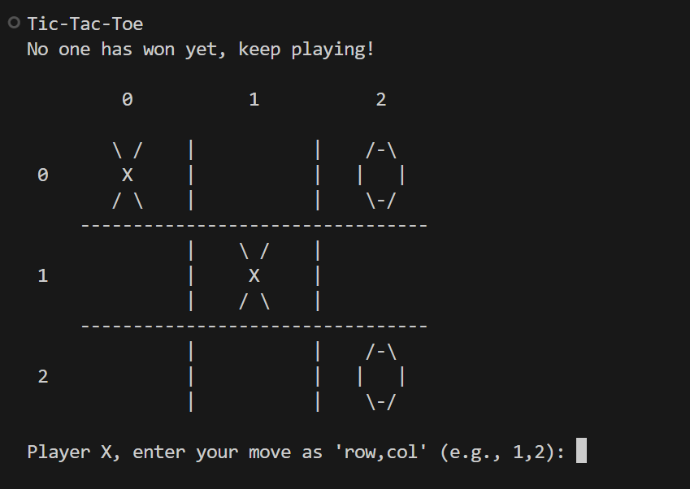
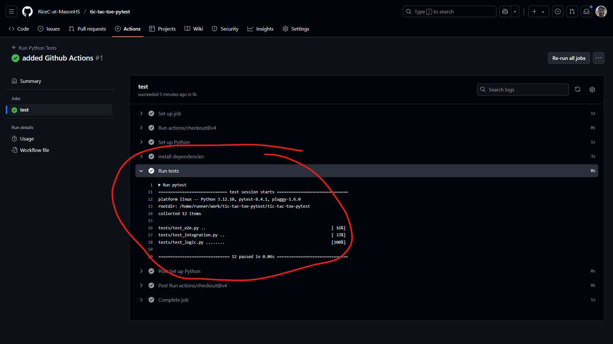

# Tic-Tac-Toe (Terminal Edition)

A simple, modular terminal-based Tic-Tac-Toe game written in Python. This project is designed for teaching and demonstration purposes, with a focus on code organization and multiple layers of testing.



---

## Overview

- Play Tic-Tac-Toe in your terminal against another human.
- The code is split into modules for game logic, display, and input handling.
- Designed to illustrate best practices in modular programming and testing.

## Folder Structure

```
tic-tac-toe/
├── src/
│   ├── logic.py
│   ├── display.py
│   ├── input_handler.py
│   └── main.py
├── tests/
│   ├── test_logic.py
│   ├── test_integration.py
│   └── test_e2e.py
├── requirements.txt
├── .gitignore
├── README.md
```

---

## Testing Layers

This project demonstrates five main types of testing.
First are two layers of informal testing, then three categories of automated testing (as shown below).

But there are still more possible ways to test your programs, manually or automatically. 

### 1. User/Playtesting

- Run the game with `python src/main.py`.
- Play the game as a user, trying different moves and edge cases (like invalid input or quitting with `CTRL+C`).
    Here are some edge cases to try:
    - **Entering a move outside the board:** Try typing a number that's not 1-9 (like `0`, `10`, or `-1`) and see how the game responds.
    - **Choosing a spot that's already taken:** Try to place your mark on a square that's already filled.
    - **Entering something that's not a number:** Type a letter or symbol (like `a` or `!`) instead of a number.
    - **Quitting the game:** Press `CTRL+C` during your turn to see how the program handles an unexpected exit.
    - **Filling the board without a winner:** Play until all spaces are filled and check if the game correctly declares a draw.

- This is the most basic form of testing: using the program as intended and observing its behavior.

### 2. In-Module `if __name__ == "__main__":` Tests

- Each module (`logic.py`, `display.py`, `input_handler.py`) includes a block at the end with basic tests or demonstrations.
- Run a module directly (e.g., `python src/logic.py`) to see these tests in action.
- These are quick, informal checks to verify that individual functions work as expected.

### 3. Formal Unit Testing with [pytest](https://docs.pytest.org/en/stable/)

- Formal, automated unit tests are provided in the `tests/` directory (e.g., `tests/test_logic.py`).
- These tests cover the core logic functions and are designed to be run automatically.
- To run **only the unit tests**, use:
  ```sh
  pytest tests/test_logic.py
  ```
- This is the most robust and scalable way to ensure your code works and to catch regressions.

### 4. Integration Testing with [pytest](https://docs.pytest.org/en/stable/)

- Integration tests (see `tests/test_integration.py`) check that multiple parts of the program work together as expected.
- These tests simulate a sequence of moves for a full game and check for correct win/draw detection.
- To run **only the integration tests**, use:
  ```sh
  pytest tests/test_integration.py
  ```

### 5. End-to-End (E2E) Testing with [pytest](https://docs.pytest.org/en/stable/)

- E2E tests (see `tests/test_e2e.py`) simulate a full game by providing a sequence of moves as user input.
- These tests check the actual output of the program to ensure the user experience is correct.
- To run **only the E2E tests**, use:
  ```sh
  pytest tests/test_e2e.py
  ```

---

To run **all tests at once**, simply use:
```sh
pytest
```

### 6. Continuous Integration (CI) with GitHub Actions

Every time you push code or open a pull request, **GitHub Actions** will automatically run all the tests for you.  
This is called **Continuous Integration (CI)** and helps make sure that all code changes are tested and nothing is accidentally broken.

- You can see the results of these automated tests in the **Actions** tab of your repository.
- If any test fails, you’ll see a red ❌ and can click to see what went wrong.
- If all tests pass, you’ll see a green ✔️ and know your code is working!

**How it works:**  
- The workflow is defined in [`.github/workflows/python-tests.yml`](.github/workflows/python-tests.yml).
- This file tells GitHub to set up Python, install dependencies, and run `pytest` every time you push or open a pull request.

**Why is this important?**
- It helps catch bugs early, before code is merged.
- It teaches you how professional teams keep their code reliable.
- You don’t have to remember to run tests yourself—GitHub does it for you!



> **Learn more:**  
> - [GitHub Actions documentation](https://docs.github.com/en/actions)
> - [What is Continuous Integration? (GitHub Docs)](https://docs.github.com/en/actions/automating-builds-and-tests/about-continuous-integration)
> - Long-running test [can incur costs on GitHub](https://docs.github.com/en/billing/managing-billing-for-your-products/managing-billing-for-github-actions/about-billing-for-github-actions), but there is a generous free tier

---

## Other Testing Layers

Beyond the main types of testing shown above, there are additional ways to test and improve your code. Here are a few concepts you might encounter as you continue learning:

- **Mocking/Monkeypatching:**  
  Sometimes, you want to test a function that depends on user input or output, but you don't want to actually type at the keyboard or print to the screen during your test. Mocking (or "monkeypatching") lets you temporarily replace parts of your code (like `input()` or `print()`) with something else, so you can simulate different scenarios and check how your code responds.

- **Property-Based Testing:**  
  Instead of writing specific test cases, property-based testing tools (like [`hypothesis`](https://hypothesis.readthedocs.io/en/latest/) in Python) generate lots of random inputs for your functions and check that certain properties always hold true. This can help you find edge cases you might not have thought of.

- **End-to-End (E2E) Testing with Automation Tools:**  
  For more complex programs, you can use special tools to simulate a real user interacting with your program from start to finish, checking that everything works together as expected.

These advanced testing techniques are powerful tools for building reliable software. For now, focus on understanding and practicing the main layers of testing in this project. As you grow as a programmer, you'll discover when and how to use these additional methods!

---

## Getting Started

1. Clone the repository.

2. (Recommended) **Create a virtual environment:**

   - **Windows:**
     ```sh
     python -m venv venv
     ```
   - **macOS/Linux:**
     ```sh
     python3 -m venv venv
     ```

3. **Activate the virtual environment:**

   - **Windows:**
     ```sh
     venv\Scripts\activate
     ```
   - **macOS/Linux:**
     ```sh
     source venv/bin/activate
     ```

4. **Install `pytest` if you want to run the unit tests:**
   ```sh
   pip install pytest
   ```
   Alternatively, you can install the exact version of `pytest` this was written with by using the command:  
   ```sh
   pip install -r requirements.txt
   ```
   (Note: This may require Python 3.12.10 for full compatibility.)

5. **Run the game:**
   ```sh
   python src/main.py
   ```

6. **Run the tests:**
   ```sh
   pytest
   ```

---

## Educational Value

This project is ideal for teaching:
- Modular code design
- Separation of concerns
- Multiple layers of software testing
- Basic terminal input/output in Python

Enjoy playing and learning!

> **Note for beginners:**  
> You’ll see a few lines at the top of each test file that add the `src` folder to Python’s path. This makes sure your tests can always find your code, no matter what computer or operating system you’re using, or where you run `pytest` from. It’s the easiest and most reliable way for new programmers!

---

## Contributing

We welcome contributions from students!  
**Please read our [CONTRIBUTING.md](CONTRIBUTING.md) for guidelines on how to propose changes, open pull requests, and understand our code review process.**

---

**Summary for beginners:**  
- Always make changes on a branch, not directly on `main`.
- Open a pull request for your changes.
- Wait for your teacher or a code owner to review and merge your code.
- Ask questions and learn from the feedback!

---